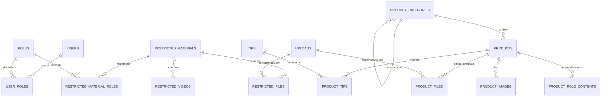

# Documentação do Banco de Dados - Orquídea Profissional

Esta documentação descreve a estrutura do banco de dados, o mapeamento de entidades e as relações do sistema Orquídea Profissional. O sistema utiliza um banco de dados **Microsoft SQL Server** legado, integrado a uma aplicação **Django**.

## 🏗️ Visão Geral da Arquitetura

- **Banco de Dados**: Microsoft SQL Server (Engine: `mssql`)
- **Collation**: `Latin1_General_CI_AS` (padrão legado)
- **Mapeamento ORM**: Django Models com `managed = False` (as tabelas são gerenciadas externamente ou existem previamente).
- **Autenticação**: Baseada em JWT com backend customizado para compatibilidade com hashes legados.

---

## 🗺️ Diagrama de Entidade-Relacionamento (Simplificado)

---

## 📁 Módulos e Tabelas

### 1. Usuários e Segurança
Gerencia o acesso ao portal e ao CMS, definindo permissões por tipo de usuário e papéis específicos.

| Tabela | Descrição | Campos Principais |
| :--- | :--- | :--- |
| `users` | Cadastro principal de usuários. | `email`, `password_hash`, `user_type`, `status`, `is_active` |
| `roles` | Definição de perfis de acesso (Vendedor, Técnico, etc). | `name`, `access_area` |
| `user_roles` | Tabela de ligação N:N entre usuários e papéis. | `user_id`, `role_id` |

**Tipos de Usuários (`user_type`):**
- `admin`: Acesso total ao CMS e Portal.
- `interno`: Equipe de Marketing/Operacional (Acesso ao CMS).
- `vendedor`, `tecnico`, `cliente`: Perfis de acesso restrito ao Portal B2B.

---

### 2. Catálogo de Produtos
Estrutura hierárquica de produtos, categorias e ativos relacionados.

| Tabela | Descrição | Campos Principais |
| :--- | :--- | :--- |
| `products` | Dados principais dos produtos. | `name`, `slug`, `sku`, `image_url`, `is_active`, `category_id` |
| `product_categories` | Categorias com suporte a auto-relacionamento (árvore). | `name`, `parent_id`, `sort_order` |
| `product_images` | Galeria de imagens adicionais por produto. | `image_url`, `sort_order` |
| `product_files` | Documentos técnicos vinculados a produtos. | `title`, `upload_id`, `external_url`, `role_id` |
| `product_role_contents` | Conteúdo ou regras específicas por papel de usuário. | `product_id`, `role_id`, `content` |

---

### 3. Conteúdo Institucional e Marketing
Páginas estáticas, marcas parceiras e dicas profissionais.

| Tabela | Descrição | Campos Principais |
| :--- | :--- | :--- |
| `pages` | Páginas institucionais dinâmicas. | `slug`, `title`, `content`, `is_active` |
| `brands` | Marcas e representadas. | `name`, `image_url`, `external_link` |
| `stores` | Localizador de lojas e pontos de venda. | `title`, `city`, `latitude`, `longitude` |
| `tips` | Blog de dicas profissionais. | `title`, `slug`, `content`, `published_at` |
| `product_tips` | Vínculo entre produtos e dicas específicas. | `product_id`, `tip_id` |

---

### 4. Treinamento e Área Restrita
Materiais exclusivos para técnicos e vendedores (EAD/Documentação).

| Tabela | Descrição | Campos Principais |
| :--- | :--- | :--- |
| `restricted_materials` | Cabeçalho do material/treinamento. | `title`, `audience_type`, `published_at` |
| `restricted_files` | PDFs ou documentos de treinamento. | `title`, `upload_id` |
| `restricted_videos` | Links de vídeos (YouTube/Vimeo). | `title`, `video_url` |
| `restricted_material_roles` | Define qual Perfil (`Role`) pode ver qual Material. | `material_id`, `role_id` |

---

### 5. Gestão de Mídia
Centralização de uploads de arquivos.

| Tabela | Descrição | Campos Principais |
| :--- | :--- | :--- |
| `uploads` | Registro de arquivos físicos salvos no servidor. | `original_name`, `file_path`, `mime_type`, `file_size_bytes` |

---

## 🛠️ Notas de Implementação

1. **Integridade de Dados**: Devido ao uso de tabelas legadas, algumas constraints de `Foreign Key` são tratadas via aplicação (`models.DO_NOTHING`) para evitar conflitos com o banco existente que não possui todas as chaves mapeadas.
2. **Imagens**: O sistema utiliza dois padrões:
   - Caminhos diretos (URLs ou strings) para dados legados.
   - `ImageField` do Django para novos uploads, salvando em `media/uploads/products/`.
3. **Slugs**: Utilizados para URLs amigáveis (`SEO`), garantindo que não haja dependência direta de IDs numéricos nas rotas do frontend.
